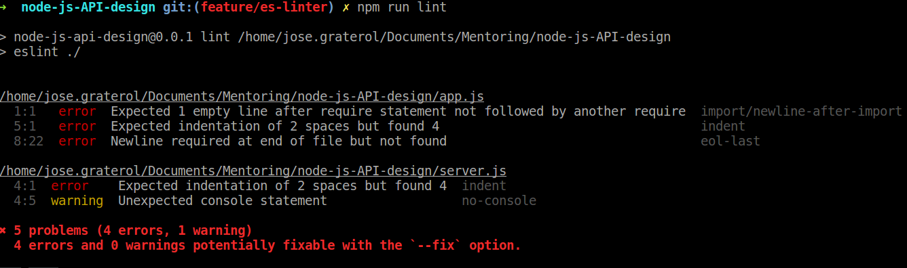

# Setup Básico

## Requisitos Previos

* Un editor de texto con soporte para el linter ESLint, por ejemplo: Visual Studio Code, Sublime Text, Atom o WebStorm
* Un sistema operativo Unix-like: Ubuntu, Debian, Mac OSX, etc...
* Instalar el manejador de versiones de Node, nvm:
    * [Tutorial para instalación de nvm](https://ingluisbeltran.wordpress.com/2015/10/15/como-gestionar-multiples-versiones-node-con-nvm/)


## Inicializar el proyecto

Para inicializar nuestro proyecto instalaremos la versión estable de NodeJS y luego usaremos `npm` el manejador de dependencias de NodeJS, para crear los archivos básicos de nuestra aplicación.

```bash
# Instala la versión estable de Node (10.6.0 al momento de escribir esto) (nvm instala npm por defecto)
nvm install v10.6.0

# Crea un directorio para el proyecto
mkdir node-js-API-design
cd node-js-API-design

# Inicializa el proyecto npm para asignar
#   nombre: node-js-api-design, 
#   versión: 0.0.1
#   archivo de entrada: server.js
npm init

# Crea el archivo .nvmrc para que nvm sepa que versión de Node utilizar
echo "v10.6.0" > .nvmrc
```

En nuestro directorio raíz ahora hay un archivo `package.json`, éste es el archivo principal de cualquier proyecto Node, allí se especifican las dependencias externas de nuestra aplicación, el nombre, la versión, y los distintos scripts y tareas necesarias para ejecutar la aplicación.

## Instalar y Configurar ExpressJS

Con nuestro proyecto inicializado el próximo paso es instalar ExpressJS, un servidor web para Node. Lo instalamos en nuestro proyecto usando `npm`

```bash
npm install express --save
```

Ahora, en la raíz de nuestro proyecto, creamos los archivos app.js y server.js

```bash
touch app.js
touch server.js
```

En `app.js` incluimos las instrucciones para inicializar nuestra aplicación Express

```javascript
// app.js

// Importamos el módulo Express y lo inicializamos
const express = require('express');
const app = express();

// Definimos la primera ruta de nuestra aplicación, en la URL base "/"
app.get('/', (req, res) => {
    res.status(200).send('Queloqueh!');
});

// Exportamos nuestra aplicación
module.exports = app;
```

En `server.js` importamos la app Express que definimos en el otro archivo y levantamos un servidor web que escuchará y atenderá las peticiones a nuestra aplicación.

```javascript
// server.js

// Importamos la aplicación que definimos en el archivo app.js
const app = require('./app');

// Usamos la aplicación para levantar un servidor que escucha en el puerto 9000
app.listen(9000, () => {
    console.log('App listening on port 9000');
});
```

Modificamos el archivo `package.json` para declarar el script `start` de nuestra aplicación.

```json
// package.json
{
  "name": "node-js-api-design",
  "version": "0.0.1",
  "description": "A NodeJS API design workshop",
  "main": "server.js",
  "scripts": {
    // Script de inicialización
    "start": "node server.js",
    "test": ""
  },
...
```

Y finalmente, usamos `npm run start` para ejecutar el script de inicialización que pone a funcionar nuestro servidor. Podemos probar que está funcionando usando la herramienta cURL desde la línea de comandos.

```bash
curl localhost:9000/
```

### Instalar ESLint y estilos de AirBnB

ESLint es una herramienta de inspección de calidad de código que analizando la sintaxis y la estructura, obligándonos a cumplir ciertas reglas pre definidas.

Usar ESLint le da uniformidad a nuestro código, sin importar quien toque nuestro *codebase*, siempre parecerá que todo fue escrito por la misma persona, siguiendo el mismo conjunto de reglas. Adicionalmente, ESLint detecta problemas relacionados a nombres y scope de variables y funciones, variables no utilizadas, errores al importar y exportar módulos, y en general aumenta muchísimo la calidad y mantenibilidad de nuestro código.

Para configurar nuestro proyecto con ESLint usaremos las reglas de AirBnB, unas de las más populares actualmente. Comenzamos instalando la herramienta CLI de ESLint en nuestro proyecto, como una dependencia de desarrollo.

```bash
npm install eslint --save-dev
```

Agregamos en nuestro `package.json` una tarea para invocar a ESLint

```json
{
  "name": "node-js-api-design",
  "version": "0.0.1",
  "description": "A NodeJS API design workshop",
  "main": "server.js",
  "scripts": {
    // Tarea para invocar al linter
    "lint": "eslint ./",
    "start": "node server.js",
    "test": ""
  },
```

Y ahora inicializamos la configuración de ESLint de nuestro proyecto, invocando a ESLint con el argumento --init

```bash
npm run lint -- --init
```

Un pequeño wizard en la CLI aparecerá y debemos seleccionar las siguientes opciones:

+ **How would you like to configure ESLint?**: `Use a popular style guide`
+ **Which style guide do you want to follow?**: `Airbnb (https://github.com/airbnb/javascript)`
+ **Do you use React?**: N
+ **What format do you want your config file to be in?**: `Javascript` (Podríamos seleccionar cualquiera)
+ **Would you like to install them now with npm?**: `Y` (Instalará las dependencias faltantes)

Agreguemos un archivo `.eslintignore` en la raíz para poder excluir algunas carpetas y archivos de la inspección de ESLint

```bash
echo "node_modules/" > .eslintignore
```

Y ejecutemos la primera inspección de ESLint sobre nuestro código

```bash
npm run lint
```

ESLint nos arroja una lista de errores para corregir en nuestro código, que iremos atacando uno por uno.



Empezamos con la identación del código que de acuerdo a las reglas de AirBnB debe usar dos espacios. 

Yo prefiero usar 4 espacios algo que podemos personalizar modificando el archivo `.eslintrc.js` donde se define la configuración que usa ESLint. Agregamos la regla `indent` con un valor personalizado de `["error", 4]` donde `error` define la severidad de la regla y el número define la cantidad de espacios a utilizar.

```javascript
//.eslintrc.js
module.exports = {
    "extends": "airbnb-base",
    "rules": {
        "indent": ["error", 4]
    }    
};
```

Luego arreglamos los dos errores del archivo app.js que nos indica ESLint, relacionados a la falta de nuevas líneas en dos partes del archivo e ignoramos temporalmente la advertencia sobre el uso de la instrucción `console`.

Ya nuestro proyecto está configurado con ESLint.

TODO: Agregar precommit hook