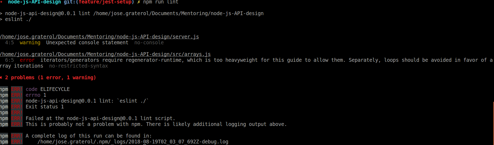

# Introducción al TDD con Jest

El Test Driven Development (TDD), desarrollo guiado por pruebas en español, es una metodología de desarrollo ágil que propone que los desarrolladores escribamos nuestras pruebas automatizadas antes de escribir el código de nuestra aplicación.

Aplicar TDD le da muy alta cobertura de pruebas a nuestro código (~100% si aplicamos la metodología correctamente), nos permite separar las fases de diseño de la especificación y codificación de la solución pero de una forma ágil y con *feedback-loops* muy cortos, y también ayuda a diseñar código modular, con pocas dependencias acopladas y con claras separaciones entre interfaces públicas y privadas ya que, usualmente, el código testeable es desacoplado, modular y con clara separación de responsabilidades.

Para este tutorial usaremos Jest, un módulo Node que usamos para escribir y ejecutar pruebas unitarias, de integración y funcionales para nuestro código.

## Instalar y Configurar Jest

Instalaremos Jest como una dependencia de desarrollo, usando npm.

```bash
npm install jest --save-dev
```

Agregamos esta línea a nuestro `package.json` para indicarle a npm como ejecutar nuestras pruebas.

```json
// package.json
{
  "name": "node-js-api-design",
  "version": "0.0.1",
  "description": "A NodeJS API design workshop",
  "main": "server.js",
  "scripts": {
    "lint": "eslint ./",
    "start": "node server.js",
    // Configuramos jest como nuestra herramienta de ejecución de pruebas
    "test": "jest"
  },
```

También agregaremos una propiedad adicional al archivo de configuración de `.eslintrc.js` para que ESLint reconozca que estamos usando Jest y no arroje errores por módulos no definidos al usar las funciones propias de Jest.

```javascript
//.eslintrc.js
module.exports = {
    "extends": "airbnb-base",
    "rules": {
        "indent": ["error", 4]
    },
    // Atributo adicional env
    "env": {
        "jest": true
    }
};

```

### Escribir Nuestras Primeras Pruebas Unitarias

Luego vamos a crear un módulo de muestra en nuestra aplicación al que le escribiremos algunas pruebas unitarias para comenzar a entender como funciona Jest.

```bash
mkdir src
mkdir test
touch src/arrays.js
touch test/arrays.test.js
```

Como la idea de este tutorial es conocer la filosofía detrás del TDD primero escribiremos las pruebas unitarias que inicialmente fallarán y luego agregaremos el código mínimo necesario para lograr que cada prueba pase. Para eso abrimos el archivo arrays.test.js y agregamos una a una nuestras pruebas.

La primera prueba que agregaremos es para la función `find` del módulo `arrays`, este método recibe como argumentos un valor a buscar y un array; si encuentra el valor, lo devuelve, si no, devuelve `null`. Esta prueba inicial prueba el llamado *happy path*, donde la función recibe el resultado correcto al recibir como argumento un elemento que existe dentro del array.

```javascript
// test/arrays.test.js

// Importamos el módulo arrays desde la carpeta src
const arrays = require('../src/arrays');

describe('find', () => { // Arrow functions, sintaxis para callbacks, al final conseguirás un link donde se explican.
    test('it finds an element when it exists in the array', () => {        
        const haystack = [1, 2, 3, 4]; // Inicialización: Array de prueba        

        const needle = arrays.find(1, haystack); // Ejecución: llamamos al método fin

        expect(needle).toEqual(1); // Validación: Verificamos que arrays.find devuelve el valor esperado
    });
});
```

En el código de arriba podemos ver como se compone una prueba básica de Jest:

+ Método `describe` para agrupar un conjunto de pruebas bajo un mismo contexto.
+ Método `test` para definir el enunciado y código de un caso de prueba. El código de cada prueba se pasa en el segundo argumento de `test` como una función callback.
+ Inicialización de los datos de prueba.
+ Ejecución del método `find`.
+ Validación de que el método `find` produjo el resultado esperado.

Al ejecuta esta prueba con el comando `npm run test` nos encontramos con un error, al leer el detalle de lo que muestra la consola vemos que el error se debe a que el método find no existe en el módulo `src/arrays`. Agreguémoslo y agreguemos de inmediato el código necesario para que la prueba se ejecute correctamente.

```javascript
// src/arrays.js

// Escribimos una implementación bastante ingenua del método find.
//  Esta implementación ignora las complejidades de las pruebas de igualdad en Javascript 
//  pero funciona por el momento

function find(element, arr) {
    for (let val of arr) {
        if (element == val) {
            return element;
        }
    }
};

module.exports = { find };
```
Luego de que nuestra primera prueba se ejecute satisfactoriamente, agregamos una nueva prueba para definir el comportamiento del método `find` cuando recibe como elemento a buscar un argumento `undefined`.

```javascript
// test/arrays.test.js
const arrays = require('../src/arrays');

describe('find', () => {
    test('it finds an element when it exists in the array', () => {
        const haystack = [1, 2, 3, 4];
        const needle = arrays.find(1, haystack);

        expect(needle).toEqual(1);
    });

    // Agregamos la nueva prueba que evalua el comportamiento cuando el método find recibe un valor undefined
    test('it throws an error when it receives and undefined element', () => {
        const haystack = [1, 2, 3, 4];

        // Cuando hay un valor undefined esperamos que el método arroje una excepción.
        //    Jest nos permite verificar si una función arroja excepciones envolviendo la invocación
        //    en otra función y probando con el método .toThrow
        expect(() => { arrays.find(undefined, haystack); }).toThrow();
    });
});
```

Cuando ejecutamos nuevamente las pruebas con `npm run test`, estas fallan porque `find` no arroja la excepción que espera nuestra prueba. Agerguemos el código necesario para que la prueba pase.

```javascript
function find(element, arr) {

    // Agregamos una guard clause al inicio para capturar los valores undefined
    if (element === undefined) {
        throw new Error('No way José!');
    }

    for (let val of arr) {
        if (element == val) {
            return element;
        }
    }
};

module.exports = { find };
```

Ahora nuestra segunda prueba pasa sin problemas cuando ejecutamos `npm run test`, y vamos a agregar un último caso de prueba que validará el comportamiento de nuestra función `find` cuando recibe un elemento para buscar que no está dentro del array.

```javascript
const arrays = require('../src/arrays');

describe('find', () => {
    test('it finds an element when it exists in the array', () => {
        const haystack = [1, 2, 3, 4];
        const needle = arrays.find(1, haystack);

        expect(needle).toEqual(1);
    });

    test('it throws an error when it receives and undefined element', () => {
        const haystack = [1, 2, 3, 4];

        expect(() => { arrays.find(undefined, haystack); }).toThrow();
    });

    // Agregamos la nueva prueba, para el caso en que el elemento a buscar no está en el array
    test('it return null when it does not find the element inside the array', () => {
        const haystack = [1,2,3,5]; // Inicialización

        const needle = arrays.find(4, haystack); // Ejecución

        expect(needle).toEqual(null); // Verificación
    });
});

```

Cuando ejecutamos las pruebas con `npm run test` la consola nos muestra el error `Comparing two different types of values. Expected null but received undefined.`. Despues de recorrer todo el array, método `find` no devuelve ningún valor explícitamente cuando esto pasa, Javascript de manera implícita devuelve el valor undefined. 

Arreglemos el método `find` para que regrese un valor por defecto si no consigue una coincidencia.

```javascript
function find(element, arr) {

    if (element === undefined) {
        throw new Error('No way José!');
    }

    for (const val of arr) {
        if (element === val) {
            return element;
        }
    }

    // Agregamos el valor de retorno null por defecto
    return null;
};

module.exports = { find };
```

Al devolver `null` cuando no hallamos una coincidencia, logramos que la tercera prueba pase exitosamente.

### Refactorizando

Una de las principales ventajas de tener pruebas automatizadas robustas es que podemos refactorizar nuestro código con confianza. Refactorizar consiste en cambiar la implementación interna de una función o método sin hacer cambios a su interfaz pública (Nombre, firma de parámetros). 

Las pruebas unitarias robustas no miran detalles internos de implementación y sólo prueban el comportamiento externo de los módulos para distintos valores de entrada, permitiendo refactorizar con confianza y sin mayores obstáculos. Esta confianza en el refactoring la vamos a aprovechar para corregir un error que nos muestra ESLint, sobre la línea `6` de nuestro archivo `src/arrays.js`.

Si ejecutamos ESLint con el comando `npm run lint` veremos en la pantalla un error relacionado al uso del loop `for (const val of arr)`



La sugerencia de ESLint es reemplazarlo por el iterador `forEach` nativo que está implementado en el prototipo de los arrays en Javascript, y eso es lo que haremos.

El iterador `forEach` puede ser usado en cualquier Array, recibe como argumento un callback que, como el nombre del método indica, se ejecutará para cada elemento del array. 

El callback será invocado con tres argumentos:

+ El elemento actual sobre el que se está ejecutando el callback
+ El índice del elemento actual dentro del array
+ El array que se está recorriendo

```javascript
function find(element, arr) {
    if (element === undefined) {
        throw new Error('No way José!');
    }

    let result = null;

    // Método .forEach disponible en todos los arrays
    arr.forEach((val) => {
        if (val === element) {
            result = val;
        }
    });

    return result;
}

module.exports = { find };
```

Hemos refactorizado nuestra función `find` y si ejecutamos nuevamente las pruebas (`npm run test`) podemos ver que estas siguen ejecutándose exitosamente lo que indica que nuestra nueva implementación respeta la especificación original sin introducir bugs o regresiones.

*Advertencia: * Usar un forEach para buscar un elemento dentro de un array es altamente ineficiente porque no tenemos forma de detener la iteración cuando conseguimos una coincidencia, este ejemplo es sólo una demo. Hay métodos nativos de los arrays Javascript que funcionan mucho mejor como `find` o `findIndex`.

## Jest y Supertest para Pruebas de Integración

Para hacer pruebas de integración de nuestros controladores vamos a instalar Supertest, una librería para hacer validaciones sobre las respuestas HTTP de nuestra aplicación.

```bash
npm install supertest superagent --save-dev
```

Supertest nos permite importar una aplicación Express, como la que definimos en el archivo app.js, enviarle peticiones HTTP y analizar sus respuestas para hacer pruebas de integración sobre nuestros controladores.

Por los momentos sólo tenemos un controlador, en la ruta raíz de nuestra aplicación. Escribamos una prueba sencilla con Jest y Supertest para ver como funcionan en conjunto, cuando estemos creando los demás controladores de la aplicación conoceremos mucho más a fondo las capacidades de Supertest.

Creamos un archivo Javascript para la prueba en la ruta `test/integration`.

```bash
mkdir test/integration
touch test/integration/app.test.js
```

```javascript
const request = require('supertest'); // Importamos Supertest
const app = require('../../app'); // Importamos nuestra app Express

describe('Test index route', () => {
    test('It should respond to the GET method with the proper body and headers', (done) => {        
        // Invocamos Supertest, pasando nuestra app como parámetro
        request(app) 
            .get('/') // Enviamos una petición GET a la ruta '/' y recibimos una promesa
            .then((response) => { 
                // El status HTTP debe ser 200
                expect(response.statusCode).toBe(200); 
                // El cuerpo de la respuesta debe corresponder con lo que esperamos
                expect(response.body).toBe('Queloqueh!'); 
                
                // Por ser una prueba asíncrona, tenemos que llamar al método done()
                // Este método le notifica a Jest que la prueba terminó de ejecutarse
                done(); 
            });
    });
});

TODO: Taggear esta versión a partir del commit correspondiente

TODO: Agregar links de lectura que aclaren conceptos como:

+ Arrow functions
+ Array.forEach
+ Pruebas de igualdad en Javascript
+ Funcionamiento de require y export en Javascript
+ Spread y definición de keys por default en objetos
+ Documentación de Jest
+ Promesas en Javascript